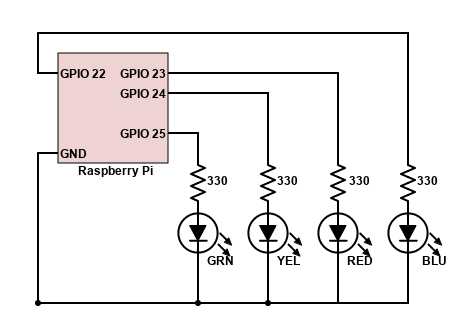

<!--
Copyright (c) 2020, 2024 Thomas Mikalsen. Subject to the MIT License 
-->


TOAST
=====

Experiments building an Operating System for the Raspberry Pi

- Preemptive multitasking operating system 
- Basic-terminal I/O
- "Concurrent Euclid"-inspired monitor-based synchronization programming model
- Implemented in C and Assembly (ARM)


Pre-reqs
--------

### Hardware

* Raspberry Pi 1 (RPi 1)
* SD Card with FAT-formatted partition (at least 512 mb) called "TOAST"
* Breadboard, break-out kit, wires, etc.
* Four (4) LEDs - Red, Green, Blue, Yellow
* Four (4) 330 ohm resistors
* USB to TTL Serial cable

### Wiring

* GPIO 25 -> 330 ohm -> LED(GRN) -> GND : Application LED 1
* GPIO 24 -> 330 ohm -> LED(YEL) -> GND : Application LED 2
* GPIO 23 -> 330 ohm -> LED(RED) -> GND : Kernel "error" LED
* GPIO 22 -> 330 ohm -> LED(BLU) -> GND : Kernel "activity" LED

(TODO - update with serial/UART wiring)



### Software

* Linux/Ubuntu workstation for development
```
sudo apt-get update -y
sudo apt install build-essential -y
```

* GCC ARM Toolchain (gcc-arm-none-eabi)

```
sudo apt-get install gcc-arm-none-eabi -y
```

* GCC Multilib

```
sudo apt-get install gcc-multilib -y
```

## Experiments
There's a progression to these experiments:

### Completed
* [**e1-blink**](./src/e1-blink): Simple bare-metal LED blinker, using ARM assembly and c code
* [**e2-arm-modes**](./src/e2-arm-modes): Experiment with changing ARM modes and SWI handlers
* [**e3-timer**](./src/e3-timer): Experiment with the BCM2835 timer peripheral and IRQs
* [**e4-context-switch**](./src/e4-context-switch): Things start to get interesting here, as we combine e2 & e3 to provide a basic preemptive multi-tasking Supervisor
* [**e5-monitor-sync**](./src/e5-monitor-sync): Adds support for "monitor" concurrency/synchronization primitives
* [**e6-uart**](./src/e6-uart): Adds support for UART interface and basic i/o to dumb terminal
* [**e7-console**](./src/e7-console): Adds an interactive console for the supervisor

### Next up
* Basic I/O - beyond LEDs
* Run on RaspberryPi 3 

References
----------

[BCM2835 ARM Peripherals](doc/BCM2835.pdf)

[ARM ARM](doc/arm-arm-ddi01001.pdf)

[JBtek USB to TTL Serial Cable](https://www.amazon.com/JBtek-WINDOWS-Supported-Raspberry-Programming/dp/B00QT7LQ88/ref=sr_1_3?dchild=1&keywords=usb+to+ttl+serial&qid=1618686848&sr=8-3)